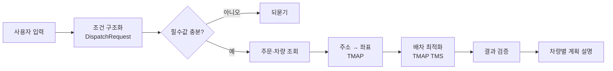

# 바다로 (BadaRo) — 횟집 체인 배차 코파일럿

횟집 10~30곳을 운영하는 본부 물류 담당자가 **"센터에서 서울 20개 지점, 차 4대로 돌려줘"** 한 줄을 입력하면,
발주와 차량을 확인하고 TMAP TMS에 배차를 요청해 **차량별 방문 순서와 도착 시각**을 만들어 설명하는 에이전트입니다.
활어는 수조차에 오래 둘 수 없어서 이 문제를 매일 새벽마다 새로 풀어야 합니다.

> SKALA 생성형 AI 서비스 개발(LangChain) 종합실습 · 5층 6반 3조

## 어떻게 동작하나



LLM은 해석·구조화·설명만 합니다. 차량 배정과 방문 순서는 TMS 결과를 그대로 쓰고, TMS가 주지 않은 값은 만들지 않습니다.

## 무엇으로 되어 있나

| 구성 | 위치 | 설명 |
|---|---|---|
| 에이전트 (Python · LangChain) | `agent/` | 자연어 → 구조화 → Tool 호출 → TMS 배차 → 결과 검증 |
| 화면 (Vue 3 · Vite) | `src/` | 센터·차량·배송지 관리, 배차 요청·결과, API 탐색. TMS 목업 내장 |
| 문서 | `docs/` | 설계서, [TMS API 명세 정리](docs/tms-api.md), [프론트 가이드](docs/frontend.md) |

## 실행

**화면**

```sh
npm install
npm run dev          # http://127.0.0.1:5173
npm test
```

**에이전트** (뼈대 올라오면 갱신)

```sh
cd agent
pip install -r requirements.txt
cp .env.example .env         # OPENAI_API_KEY, TMAP_APP_KEY
USE_MOCK=1 pytest
```

키는 `.env`에만 둡니다. TMS 배차 요청은 **하루 20건**이라 실호출은 담당자만 합니다.

## 팀

| 이름 | 역할 | 담당 |
|---|---|---|
| 김동찬 | PM / 아키텍트 | `agent/badaro/agent.py`, `README`, `docs/`, `.github/` |
| 이준형 | 모델 / 프롬프트 | `agent/badaro/schemas/`, `agent/prompts/` |
| 권유나 | API / Tool | `agent/badaro/tools/`, `agent/data/`, `docs/tms-api.md` |
| 윤소영 | 미들웨어 / 가드레일 | `agent/badaro/middleware/`, `agent/badaro/guardrails/` |
| 김강휘 | 프론트 / 테스트 | `src/`, `tests/`, `agent/tests/` |

## 어떻게 일하나

1. [Issues](../../issues)에서 자기 이슈를 가져간다. 제목 앞 `[0-준비]` `[1-개발]` `[2-통합]` `[3-발표]`가 진행 순서.
2. `main`에서 `feat/영역-내용` 브랜치를 팬다. 이슈 하나에 브랜치 하나.
3. 자기 폴더만 고친다. 남의 폴더가 필요하면 PR 본문에 요청.
4. PR 올리기 전에 `git pull --rebase origin main`. PR은 작게, 본문에 **왜**를 한 줄.
5. 리뷰 1명 + CI 통과 → **Squash and merge** → 브랜치 삭제.
6. 설계와 다르게 만들었으면 설계서 **변경 이력**에 사유를 남긴다.

자세한 규칙은 [CONTRIBUTING.md](CONTRIBUTING.md). 막히면 30분 넘기지 말고 채팅에 올립니다.
