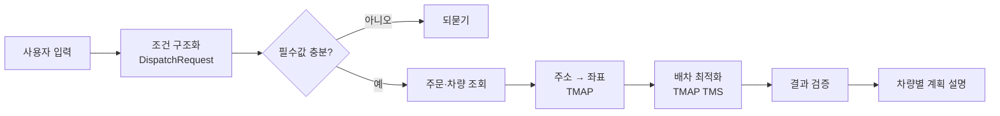

# 바다로 BadaRo 횟집 체인 배차 지원

바다로는 횟집 체인 본부의 물류 담당자를 위한 배차 지원 서비스입니다. 자연어 요청에서 배송 조건을 추출하고, 주문과 차량 정보를 확인해 TMAP TMS에 배차를 요청하도록 개발하고 있습니다. 활어 운송 시간, 차량 적재량, 지점별 납품시간을 고려합니다.

현재 Vue 화면은 센터·차량·주문 선택과 배차 결과를 왼쪽 패널에, 배송 위치·경로를 오른쪽 지도에 표시합니다. 노량진센터와 서울 지점의 CSV 샘플로 목업 배차를 실행할 수 있습니다. Python 에이전트는 개발 폴더와 설치 환경을 준비했으며, 자연어 처리와 실제 배차 API 연결은 개발 예정입니다.

> SKALA 생성형 AI 서비스 개발(LangChain) 종합실습 · 5층 6반 3조

## 배차 처리 계획



LLM은 해석·구조화·설명만 합니다. 차량 배정과 방문 순서는 TMS 결과를 그대로 쓰고, TMS가 주지 않은 값은 만들지 않습니다.

## 구성

| 구성                          | 위치     | 설명                                                                            |
| ----------------------------- | -------- | ------------------------------------------------------------------------------- |
| 에이전트 (Python · LangChain) | `agent/` | 패키지·개발 환경 준비. 자연어 처리와 Tool 통합은 개발 예정                      |
| 화면 (Vue 3 · Vite)           | `src/`   | 센터·차량·주문 선택, 배차 진행 모달·결과, Leaflet 배송 지도. TMS 목업 내장      |
| 문서                          | `docs/`  | 설계서, [TMS API 명세 정리](docs/tms-api.md), [프론트 가이드](docs/frontend.md) |

## 실행

**화면**

```sh
npm install
npm run dev          # http://127.0.0.1:5173
npm test
```

**에이전트 개발 환경** (Python 3.11 이상, CI는 3.11)

```sh
cd agent
python3 -m venv .venv
source .venv/bin/activate    # Windows PowerShell: .venv\Scripts\Activate.ps1
python -m pip install -r requirements.txt
cp .env.example .env         # 아직 키를 입력하지 않아도 검증 가능
python -m ruff check .
USE_MOCK=1 python -m pytest
```

현재 에이전트 테스트는 키 없이 패키지를 import하는 준비 단계만 검증합니다. 자연어 배차 실행은 B-17 통합 이후 제공하며, `USE_MOCK` 전환과 `.env` 로딩도 해당 구현에서 연결합니다. 프론트 목업은 지금 실행할 수 있습니다.

의존성은 `agent/pyproject.toml`에서 관리합니다. `requirements.txt`는 개발 도구를 포함한 패키지 설치 진입점입니다. 모델명은 설계서의 미확정 항목이므로 `.env.example`에서 비워 두었습니다.

키는 서버의 `agent/.env`에만 둡니다. TMS 배차 요청은 **하루 20건**이라 실호출은 담당자만 합니다.

## 폴더 구조와 설계 기준

```text
agent/
  badaro/
    agent.py           # PM 통합 지점 (B-17)
    schemas/           # 요청·결과 스키마 (B-03, B-05)
    tools/             # 주문·차량 조회, 지오코딩, 배차 (B-08~10)
    middleware/        # Context·State·Store, 실행 제어 (B-11~14)
    guardrails/        # 입력·출력 검증 (B-14)
  prompts/             # System Prompt·Few-shot (B-06)
  data/                # 주문·차량 CSV와 목업 데이터 (B-04, B-10)
  tests/               # Python 테스트 (B-16)
  pyproject.toml       # Python 패키지·의존성·검증 설정
  requirements.txt
  .env.example
src/                   # Vue 통합 배차 화면
data/                  # 프론트 목업용 노량진 배송 CSV·지오코딩 기록
tests/                 # 프론트 단위·브라우저 테스트
docs/                  # 설계서·프론트 가이드·API 문서
  api/                 # 인증키를 제거한 실 API 요청·응답 예시
notebooks/             # 개인 실험, notebooks/본인이름/ 사용
.github/               # CI·CODEOWNERS·PR 템플릿
```

[설계서 v1.2](docs/6반_3조_설계서_v1.2.docx)는 미들웨어·가드레일의 실행 순서, 결과 대조, 개인정보 보호와 실패 처리 기준을 보완한 개정본입니다. [v1.1](docs/6반_3조_설계서_v1.1.docx)과 [초안 v1](docs/6반_3조_설계서_v1.docx)도 보관합니다. 설계 기준이며 해당 기능의 구현 완료를 뜻하지 않습니다. [설계서와 코드의 대응 및 미확정 사항](docs/README.md)을 함께 확인하세요.

CI는 프론트 lint·단위 테스트·build와 에이전트 Ruff·문법·import 테스트를 실행합니다. Python 업무 시나리오가 추가되면 같은 pytest 작업에서 실행됩니다. 브라우저 검증은 [프론트 가이드](docs/frontend.md)의 별도 명령을 사용합니다.

## 팀

| 이름   | 역할                | 담당                                                    |
| ------ | ------------------- | ------------------------------------------------------- |
| 김동찬 | PM / 아키텍트       | `agent/badaro/agent.py`, `README`, `docs/`, `.github/`  |
| 이준형 | 모델 / 프롬프트     | `agent/badaro/schemas/`, `agent/prompts/`               |
| 권유나 | API / Tool          | `agent/badaro/tools/`, `agent/data/`, `docs/tms-api.md` |
| 윤소영 | 미들웨어 / 가드레일 | `agent/badaro/middleware/`, `agent/badaro/guardrails/`  |
| 김강휘 | 프론트 / 테스트     | `src/`, `tests/`, `agent/tests/`                        |

## 작업 절차

1. [Issues](../../issues)에서 담당 이슈를 선택한다. 제목의 `[0-준비]` `[1-개발]` `[2-통합]` `[3-발표]`순서로 진행한다.
2. `main`에서 `feat/영역-내용` 브랜치를 만든다. 이슈마다 브랜치를 만든다.
3. 담당 폴더에서 작업한다. 다른 담당자의 파일 수정은 대상과 사유를 PR 본문에 적어 요청한다.
4. PR을 만들기 전에 `git pull --rebase origin main`으로 최신 변경을 반영한다. 본문에 변경 사유를 적는다.
5. 리뷰 1명 + CI 통과 → **Squash and merge** → 브랜치 삭제.
6. 설계와 다르게 만들었으면 설계서 **변경 이력**에 사유를 남긴다.

작업 규칙과 문구 작성 기준은 [CONTRIBUTING.md](CONTRIBUTING.md)를 따릅니다. 문제 해결이 30분 이상 지연되면 상황과 오류 내용을 팀에 공유합니다.
