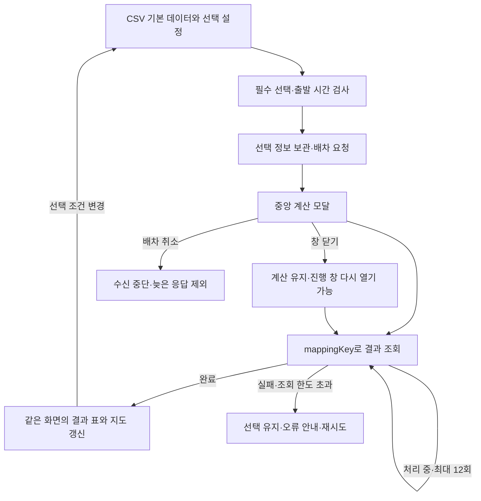

# 바다로 통합 배차 화면 설계

바다 랜딩에서 진입하는 배차 화면은 왼쪽 선택·결과와 오른쪽 지도로 구성합니다. 배차의 기본 상태·계산 모달·완료 상태는 `/workspace` 안에서 이어집니다. 채팅은 Python Agent와 연결하고 검증된 배차 결과를 표·점선 지도로 표시합니다. 아래 선택 패널·계산 모달은 키 없는 별도 프론트 목업입니다. 선택값은 채팅 요청에 적용되지 않습니다. Agent 실행·검증은 [실행 안내](agent-integration.md)를 따릅니다.

## 화면 배치

- 헤더: 바다로 로고, 배송 배차 제목, 목업 상태와 배송 데이터 날짜.
- 왼쪽 약 44%: 센터·차량·배송정보 패널을 세로로 배치하고, 출발 시간·배분 기준·센터 복귀 옵션과 배차 요청 영역을 이어서 배치합니다. 그 아래 결과 제목 바, 차량별 요약 표, 선택 차량의 상세 표와 미배차 사유가 있습니다.
- 오른쪽 약 56%: 헤더 아래 전체 높이의 지도, 차량별 색상 범례, 전체 위치 보기와 목업 경로 안내를 표시합니다. 왼쪽 스크롤이나 결과 확장으로 지도 크기가 변하지 않습니다.
- 계산 중: 배경을 어둡게 하고 요청 수량·진행 단계·경과 시간을 보여주는 중앙 모달.

기본 `/`는 물 표면·로고·물고기를 사용하는 기존 진입 랜딩입니다. 로고를 누르면 바다가 갈라지는 1.25초 전환으로 `/workspace`에 진입합니다. 모션 감소 설정에서는 즉시 이동합니다. 배차 헤더 로고는 랜딩으로 돌아갑니다. 기존 `/workspace` 하위 주소는 `/workspace`로 연결하며 별도의 관리 메뉴와 8단계 이동은 사용하지 않습니다. 차량명이나 지도 범례·마커를 선택하면 같은 차량의 배송 순서가 펼쳐지고 왼쪽 결과 위치로 스크롤합니다. 경로 체크박스와 모두 보기·숨기기는 지도 표시를 제어하며 결과 표의 수치를 변경하지 않습니다.

## 프론트 목업의 상태와 요청

`src/stores/dispatch-console.ts`에서 선택 정보, 요청 스냅샷, 요청 키, 처리 상태, 모달 상태, 경과 시간, 결과, 선택 차량과 표시할 경로를 관리합니다. 계산 중에는 설정 입력을 막고 배차 버튼은 기존 진행 창을 엽니다. 취소·설정 변경·화면 해제 시 실행 번호를 갱신해 이전 비동기 응답을 결과로 적용하지 않습니다. 완료·취소·실패 시 타이머를 정리합니다.

프론트엔드의 결과 수신 취소이며 외부 서버의 작업 취소 API를 호출하지 않습니다. 현재 실행 결과는 메모리에만 보관하고 새로고침하면 초기화합니다.

## 프론트 목업의 데이터와 계산

`src/data/noryangjin.ts`에서 검증된 CSV를 읽습니다. 노량진센터 1곳·가상 지점 20곳·차량 5대·주문 40건이 기본 선택입니다. 코드 문자열, 숫자 단위, 지점·센터 참조 관계를 CSV 어댑터에서 검사합니다. 자세한 컬럼과 지오코딩 원본 응답은 [데이터 안내서](../data/README.md)에 있습니다.

배차 엔진은 기존 24개 API 계약을 유지합니다. `/allocation`에 선택 ID와 출발 시간·배분 기준·복귀 여부를 전달하고 `/allocationData`로 결과를 받습니다. 센터·배송일·화면의 복귀 설정은 공식 필드와 분리한 `MockContext`로 전달합니다. 차량 유형, 확장 필드의 운송 가능 품목, 적재량, 권역과 교차금지선을 검사합니다. 자세한 계약은 [TMS API 목업](tms-api.md)을 참고하세요.

지도 배경은 Leaflet과 OpenStreetMap입니다. 출처를 표시하고 화면 범위의 타일만 요청합니다. 지도 팝업은 DOM `textContent`로 구성합니다. 같은 차량이 같은 좌표에 여러 번 배송하면 마커에 해당 순서들을 함께 표시합니다.

직선 경로, 시속 30km, 품목행별 작업 시간으로 시연 결과를 계산합니다. 납품 희망시간은 표에 보존하지만 시간창 제약이나 교통 상황을 반영하지 않습니다. 냉장차 2호의 냉동 운송 능력은 데이터 가정입니다. 미배차는 사유를 표시하며 실제 TMS 최적화 결과로 표현하지 않습니다.

## 시각 규칙과 접근성

청록색 `#077b89`, 짙은 청록 `#075b68`, 옅은 물색 표·선택 배경으로 통일합니다. 랜딩의 SSRO WaterDrop 설정을 보존하고 배차 화면에 사용자 제공 JayeonSans를 적용하며 바다로 투명 PNG 로고를 사용합니다. 본문 18px, 보조 글자 15~16.5px, 화면 제목 24px로 기존 글자 크기를 1.5배 확대하고 버튼·입력·아이콘·여백을 함께 조정합니다. 모바일에서는 선택 목록의 이름과 중량·시간을 두 줄로 배치합니다. 랜딩 로고는 최대 1000px 너비와 luminosity 블렌드, 흰 윤곽선·짙은 그림자로 배경과 구분합니다.

데스크톱은 왼쪽 설정·결과 패널만 세로 스크롤하고, 오른쪽 지도는 화면 높이를 유지합니다. 1100px 이하에서는 선택·결과 다음에 지도를 배치합니다. 넓은 표는 해당 영역 안에서만 가로 스크롤하며 빈 상태 안내는 왼쪽 패널 너비에 맞게 표시합니다.

입력·차량 선택·지도 표시 버튼에 접근 가능한 이름을 부여합니다. 모달은 네이티브 `dialog`로 초점을 가두고 Escape로 닫을 수 있습니다. 완료하면 결과 제목으로 초점을 이동하며 상태 메시지를 알립니다. 모션 감소 설정에서는 로딩 장식을 정지합니다.

## 검증

단위 테스트는 CSV 호환성·기록된 지오코딩 결과·API 계약·품목 적합성·적재 한도·센터 복귀·배송 날짜·취소·중복 요청·실패 복구·조회 한도를 확인합니다. 브라우저 테스트는 랜딩 진입·복귀·모션 감소, 좌우 배치와 독립 스크롤, 기본→계산 모달→결과 흐름, 지도와 표의 차량 선택 연동, 경로 표시, 다운로드, 미배차, 기존 주소 이동, 모바일, 배경 지도 실패를 확인합니다. 자동 테스트에서는 지도 타일을 고정 응답으로 대체합니다.

## 문서 변경 이력

| 날짜       | 변경 내용                                                                                                                                                   |
| ---------- | ----------------------------------------------------------------------------------------------------------------------------------------------------------- |
| 2026-09-11 | 채팅 배차의 확정 좌표를 방문 순서대로 점선 연결하고 차량별 색상·순서 마커를 표시합니다. 지도에서 에이전트 결과와 목업을 전환하며 새 요청 시 이전 경로를 지웁니다. |
| 2026-09-11 | 8단계 화면을 선택·결과·지도의 통합 배차 화면으로 변경하고 CSV 샘플, 진행 모달, 확대된 글자·컨트롤 및 랜딩 로고 처리를 반영했습니다.                         |
| 2026-09-11 | main의 Python 기본 구조·CI·설계서 v1.2를 통합하고 프로젝트 개요와 프론트 가이드를 분리했습니다. 현재 통합 배차 화면과 확대된 로고·글자·컨트롤은 유지합니다. |
