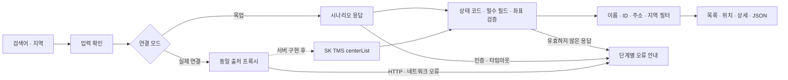

# 센터 조회 프론트엔드 설계

## 범위와 전제

이 문서는 현재 Vue 화면의 구성과 API 응답 처리 방법을 설명합니다. 센터·차량·배송지·권역·교차금지선 관리와 목업 배차 요청을 다룹니다. [24개 API와 확장 목업 설계](tms-api.md)를 함께 참고하세요.

## 흐름

## 상태

- Runtime 설정: 각 조회 시작 시 검색 조건, 데이터 모드, 테스트 시나리오를 복사합니다.
- 화면 State: 조회 결과, 선택 센터, 단계 상태, 원본 응답, 최근 실행 결과.
- 세션 기록: 현재 탭의 메모리에 최근 30회 저장하며 새로고침 시 초기화합니다.
- 영속 메모리와 LLM Context는 없습니다.

## API 계약

2026-09-10에 [센터 목록조회 명세](https://tms-skopenapi.readme.io/reference/센터-목록조회)의 페이지 내 OpenAPI 정의를 확인했습니다.

| 항목               | 값                                                                  |
| ------------------ | ------------------------------------------------------------------- |
| 메서드             | GET                                                                 |
| 원본 주소          | `https://apis.openapi.sk.com/tms/centerList`                        |
| 인증               | `appKey`, 실제 연결 시 서버에서 처리                                |
| 성공               | `resultCode: "200"`, `resultData: Center[]`                         |
| 문서화된 HTTP 오류 | 401                                                                 |
| 센터 필드          | centerId, updateDate, address, latitude, seq, centerName, longitude |

페이지의 query 파라미터와 header 보안 정의 모두에 appKey가 등장하므로 실제 제공 정보로 인증 방식을 확정합니다. 샘플 키는 복사하거나 호출에 사용하지 않습니다.

응답 검증은 프론트에서 사용하는 필드의 타입, 위도·경도 범위, 중복 ID, 결과 개수를 검사합니다. 서버의 실패 메시지를 HTML로 렌더링하지 않습니다. 예상하지 못한 응답은 결과로 표시하지 않고 검증 단계에서 중단합니다. LLM 기반 가드레일이나 프롬프트 주입 탐지는 이 범위에 없습니다.

## 시연 시나리오

| 입력                                     | 기대 결과                              |
| ---------------------------------------- | -------------------------------------- |
| 정상 응답, 전체 지역                     | 목업 센터 8개, 5단계 완료              |
| 검색어 강남                              | 강남센터 1개                           |
| 경기도                                   | 목업 센터 2개                          |
| 존재하지 않는 이름 또는 빈 목록 시나리오 | 정상 완료, 센터 0개                    |
| 인증 오류                                | API 호출 단계에서 실패, 후속 단계 대기 |
| 타임아웃                                 | API 호출 단계 실패, 무한 재시도 없음   |
| 응답 형식 오류                           | 응답 검증 단계 실패                    |
| 프록시 경로에서 HTML 응답                | JSON 오류 표시, 목업 대체 없음         |

목업 타임아웃은 시연 속도를 위해 약 1.4초 후 오류를 발생시킵니다. 실제 fetch는 AbortController로 8초 후 중단합니다. 설정 변경 및 신규 실행 시 이전 결과를 비워 데이터 소스 혼동을 방지합니다.

## 화면 구성과 시각 규칙

메인에는 물 표면 사진, 바다로 로고, 물고기 애니메이션을 표시합니다. 로고를 누르면 센터 조회 화면으로 이동합니다. 내부 화면은 상단 메뉴, 페이지 제목, 구간 이동 버튼, 좌측 입력 영역, 우측 조회 요약으로 구성합니다.

- 데스크톱: 콘텐츠 최대 1280px(1800px 이상 화면에서는 1440px), 좌우 약 2:1 비율, 카드 간격 48px(대형 화면 64px).
- 입력: 높이 62px, 모서리 11px, 필드 간격 35px. 메인 입력 카드 모서리 20px, 요약 카드 모서리 28px.
- 색상: 바다색 `#087f95`, 짙은 청록 `#075566`, 밝은 물색 `#e8f5f7`, 본문 배경 `#f3f6f8`.
- 폰트: 사용자 제공 JayeonSans 전역 적용. 메인 제목은 제공된 로고 이미지로 표시하고, 메인의 텍스트 글꼴 설정은 SSRO WaterDrop을 유지합니다. 별도 시작하기 버튼 없이 로고를 클릭하면 바다가 갈라지는 1.25초 전환 후 입장하며, 모션 감소 설정에서는 즉시 이동합니다.
- 구간 표시는 조회 조건·센터 목록·센터 상세·실행 결과로 이동하며, 이동한 영역에 키보드 포커스를 전달합니다. 처리 단계 자체는 별도의 5단계 동작 흐름에서 표시합니다.
- 모바일: 입력 → 조회 요약 및 실행 버튼 → 결과 → 상세 → 동작 흐름 순서. 넓은 표는 카드 내부에서만 가로 스크롤합니다.
- 실행 기록은 전체·완료·실패로 필터링합니다.
